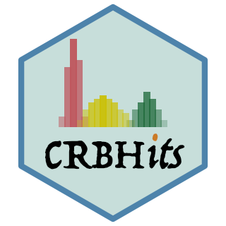

# CRBHits <a href="https://mpievolbio-it.pages.gwdg.de/crbhits/"></a>

[](https://gitlab.gwdg.de/mpievolbio-it/crbhits/-/commits/master)
[](CODE_OF_CONDUCT.md)
[](http://opensource.org/licenses/MIT)
[](https://doi.org/10.21105/joss.02424)

CRBHits - From Conditional Reciprocal Best Hits to Codon Alignments and Ka/Ks in R
=========

R package source code: [https://gitlab.gwdg.de/mpievolbio-it/crbhits](https://gitlab.gwdg.de/mpievolbio-it/crbhits)

R package pages: [https://mpievolbio-it.pages.gwdg.de/crbhits/](https://mpievolbio-it.pages.gwdg.de/crbhits/)

R package issues: [https://gitlab.gwdg.de/mpievolbio-it/crbhits/issues](https://gitlab.gwdg.de/mpievolbio-it/crbhits/issues)

# CRBHits - Description

[CRBHits](https://gitlab.gwdg.de/mpievolbio-it/crbhits) is a reimplementation of the Conditional Reciprocal Best Hit (CRBH) algorithm [crb-blast](https://github.com/cboursnell/crb-blast) in R. It covers all necessary steps from CRBHit pair calculation to Codon Alignments and Ka/Ks.

The CRBH algorithm was introduced by [Aubry S, Kelly S et al. (2014)](http://www.plosgenetics.org/article/info%3Adoi%2F10.1371%2Fjournal.pgen.1004365) and ported to python [shmlast](https://pypi.org/project/shmlast/) ([Scott C. 2017](https://joss.theoj.org/papers/10.21105/joss.00142)) which benefits from the blast-like sequence search software [LAST](https://gitlab.com/mcfrith/last) ([Kiełbasa SM et al. 2011](https://genome.cshlp.org/content/21/3/487.long)).

Like [shmlast](https://pypi.org/project/shmlast/), [CRBHits](https://gitlab.gwdg.de/mpievolbio-it/crbhits) plots the fitted model of the CRBHit evalue based algorithm. In addition users can filter the CRBHit pairs prior fitting for other criteria like evalue, protein identity and/or the twilight zone of protein sequence alignments according to [Rost B. (1999)](https://academic.oup.com/peds/article/12/2/85/1550637).

[CRBHits](https://gitlab.gwdg.de/mpievolbio-it/crbhits) only takes coding nucleotide sequences as the query and target inputs, since the secondary aim of CRBHits is to calculate synonymous and non-synonymous substitutions with the R package [seqinr](https://cran.r-project.org/web/packages/seqinr/index.html) ([Sharif D, Lobry JR. 2007](https://link.springer.com/chapter/10.1007/978-3-540-35306-5_10)) or the external tool [KaKs_Calculator2.0](https://sourceforge.net/projects/kakscalculator2/files/KaKs_Calculator2.0.tar.gz/download) ([Wang D, Zhang Y et al. 2010](https://www.ncbi.nlm.nih.gov/pmc/articles/PMC5054116/)).

This is in contrast to [crb-blast](https://github.com/cboursnell/crb-blast), which can take proteins or nucleotides as the target sequences and in contrast to [shmlast](https://pypi.org/project/shmlast/), which uses nucleotides as queries and proteins as target sequences.

The resulting CRBHit pairs can be used to obtain pairwise codon alignments, which are further used to calculate synonymous and nonsynonymous substitutions using parallelization.

The Ka/Ks (also sometimes denoted as dN/dS) values can be obtained either via the codon model of [Li WH. (1999)](https://www.ncbi.nlm.nih.gov/pubmed/8433381) as implemented in the R package [seqinr](https://cran.r-project.org/web/packages/seqinr/index.html) or the model of [Yang Z and Nielson R. (2000)](https://www.ncbi.nlm.nih.gov/pubmed/10666704) as implemented in [KaKs_Calculator2.0](https://sourceforge.net/projects/kakscalculator2/files/KaKs_Calculator2.0.tar.gz/download).

The following two images show the two main functions of the package `cds2rbh()` and `rbh2kaks()`, which are described in more detail in the package vignettes.


# Installation

see also here for the R package pages [https://mpievolbio-it.pages.gwdg.de/crbhits/](https://mpievolbio-it.pages.gwdg.de/crbhits/)

## R specific installation prerequisites

### install packages from [cran](https://cran.r-project.org/web/packages/index.html)

In most cases you need to first install the following system-wide packages to be able to compile the R dependencies. If you do not have 'sudo' rights, please ask your system-admin to install them for you.

Ubuntu/Debian

```
sudo apt-get install libcurl4-openssl-dev libssl-dev libxml2-dev libglu1-mesa-dev libgit2-dev
#Pandoc is required to build R Markdown vignettes
#sudo apt-get install pandoc
#pkgdown dependencies - pkgdown is used to build R package pages
#sudo apt-get install libssh2-1-dev libfontconfig1-dev libharfbuzz-dev libfribidi-dev libfreetype6-dev libpng-dev libtiff5-dev libjpeg-dev
```

CentOS

```
sudo yum install libcurl-devel openssl-devel libxml2-devel mesa-libGLU-devel libgit2-devel
#Pandoc is required to build R Markdown vignettes
#sudo yum install pandoc
#pkgdown dependencies - pkgdown is used to build R package pages
#sudo yum install libssh2-devel fontconfig-devel harfbuzz-devel fribidi-devel freetype-devel libpng-devel libtiff-devel libjpeg-turbo-devel
```

- [devtools](https://cran.r-project.org/web/packages/devtools/index.html)

```
install.packages("devtools")
```

### install [CRBHits](https://gitlab.gwdg.de/mpievolbio-it/crbhits)

```
devtools::install_gitlab("mpievolbio-it/crbhits", host = "https://gitlab.gwdg.de",
build_vignettes = FALSE, dependencies = TRUE)
#devtools::install_github("kullrich/CRBHits", build_vignettes = FALSE, dependencies = TRUE)
CRBHits::make_last()
CRBHits::make_KaKs_Calculator2()
CRBHits::make_dagchainer()
```

If the functions `CRBHits::make_last()`, `CRBHits::make_KaKs_Calculator2()` and `CRBHits::make_dagchainer()` fail on your system to install the prerequisites, please take a look at the [detailed description](#prerequisites) how to install via e.g. [conda](https://www.anaconda.com/) or to compile from source.

## Vignettes

These vignettes introduce  [CRBHits](https://gitlab.gwdg.de/mpievolbio-it/crbhits)

- [CRBHits Basic Vignette](https://mpievolbio-it.pages.gwdg.de/crbhits/articles/V01CRBHitsBasicVignette.html) - Basic Usage of CRBHits
    - includes CRBHit pair calculation
    - includes CRBHit pair filtering
    - includes Longest Isoform selection
    - includes Codon alignments
    - includes Ka/Ks calculations
- [KaKs Vignette](https://mpievolbio-it.pages.gwdg.de/crbhits/articles/V02KaKsVignette.html) - KaKs Calculations between two species and subsequent data filter steps
    - includes *Arabidopsis thalina* and *Arabidopsis lyrata* CRBHit pair calculation
    - includes *Homo sapiens* and *Pan troglodytes* CRBHit pair calculation
    - inlcudes Longest Isoform selection
    - includes Gene/Isoform chromosomal position extraction
    - includes Tandem Duplicate Assignment
    - includes Synteny Assignment
    - includes Ka/Ks colored Dot-Plot

## Quick-guide

```
library(CRBHits)
## prerequisite: last
## if not done yet, try to compile last-1453 - uncomment the following line
#CRBHits::make_last()
## conditional reciprocal best hits (CRBHit pairs)
data("ath", package="CRBHits")
data("aly", package="CRBHits")
ath_aly_crbh <- cds2rbh(
    cds1=ath,
    cds2=aly,
    plotCurve=TRUE)
summary(ath_aly_crbh)
?cds2rbh

##kaks calculation - subset model "Li"
ath_aly_crbh$crbh.pairs <- head(ath_aly_crbh$crbh.pairs, 20)
ath_aly_crbh.kaks.Li <- rbh2kaks(
    rbhpairs=ath_aly_crbh,
    cds1=ath,
    cds2=aly,
    model="Li")
head(ath_aly_crbh.kaks.Li)
?rbh2kaks

## plot kaks
g.kaks.Li <- plot_kaks(ath_aly_crbh.kaks.Li)
?plot_kaks

## kaks calculation - subset model "YN"
## prerequisite: KaKs_Calculator2
## if not done yet, try to compile KaKs_Calculator2 - uncomment the following line
#CRBHits::make_KaKs_Calculator2()
ath_aly_crbh.kaks.YN <- rbh2kaks(
    rbhpairs=ath_aly_crbh,
    cds1=ath,
    cds2=aly,
    model="YN")

## kaks calculation using multiple threads
ath_aly_crbh.kaks <- rbh2kaks(
    rbhpairs=ath_aly_crbh,
    cds1=ath,
    cds2=aly,
    threads=2)
head(ath_aly_crbh.kaks)

## example how to calculate all pairwise kaks values given a MSA
data(hiv)
hiv_kaks.Li <- dnastring2kaks(
    cds=hiv,
    model="Li")
g.Li <- plot_kaks(hiv_kaks.Li)
g.Li

data(hiv)
hiv_kaks.NG86 <- dnastring2kaks(
    cds=hiv,
    model="NG86")
g.NG86 <- plot_kaks(hiv_kaks.NG86)
g.NG86

## codon plot - sites under possible positive selection
library(tidyr)
library(dplyr)
library(ggplot2)
hiv.xy <- codonmat2xy(dnastring2codonmat(hiv))
hiv.xy %>% select(Codon, SynMean, NonSynMean, IndelMean) %>%
    gather(variable, values, -Codon) %>% 
    ggplot(aes(x=Codon, y=values)) + 
    geom_line(aes(colour=factor(variable))) + 
    geom_point(aes(colour=factor(variable))) + 
    ggtitle("HIV-1 sample 136 patient 1 from Sweden envelope glycoprotein (env) gene")

##### see section install external tools via bioconda
## example how to use conda version of LAST
my.lastpath <- paste0(dirname(system2("which", "lastdb", stdout=TRUE)), "/")
ath_aly_crbh <- cds2rbh(ath, aly, plotCurve = TRUE,
                        lastpath = my.lastpath)
?cds2rbh

## example how to use conda version of KaKs_Calculator2.0
my.kakspath <- paste0(dirname(system2("which", "KaKs_Calculator", stdout=TRUE)), "/")
ath_aly_crbh.kaks <- rbh2kaks(ath_aly_crbh,
                              ath, aly, model = "YN",
                              kakscalcpath = my.kakspath)
?rbh2kaks

##### see section compile external tools from original source code
## example how to use own compiled version of LAST
my.lastpath <- "/tmp/last/last-1453/bin"
ath_aly_crbh <- cds2rbh(ath, aly, plotCurve = TRUE,
                        lastpath = my.lastpath)
?cds2rbh

## example how to use conda version of KaKs_Calculator2.0
my.kakspath <- "/tmp/KaKs_Calculator2/KaKs_Calculator2.0/src"
ath_aly_crbh.kaks <- rbh2kaks(ath_aly_crbh,
                              ath, aly, model = "YN",
                              kakscalcpath = my.kakspath)
?rbh2kaks
```

## External tools installation prerequisites - detailed description {#prerequisites}

### install external tools via [bioconda](https://bioconda.github.io/)

If the functions `CRBHits::make_last()`, `CRBHits::make_KaKs_Calculator2()` and `CRBHits::make_dagchainer()` fail on your system to install the prerequisites,
there is the possibility to install them via [conda](https://www.anaconda.com/):

```
conda config --add channels defaults
conda config --add channels bioconda
conda config --add channels conda-forge

conda install last
conda install kakscalculator2
conda install dagchainer

#optional sequence search algorithm
conda install mmseqs2
conda install diamond
```

After this installation, the prerequisites are supposed to be in the `PATH` and you need to set the correct `@param` in the corresponding functions of [CRBHits](https://gitlab.gwdg.de/mpievolbio-it/crbhits) like this:

```
## example how to use conda versions of LAST, KaKs_Calculator2.0 and DAGchainer
my.lastpath <- paste0(dirname(system2("which", "lastdb", stdout=TRUE)), "/")
my.kakspath <- paste0(dirname(system2("which", "KaKs_Calculator", stdout=TRUE)), "/")
my.dagchainerpath <- paste0(dirname(system2("which", "dagchainer", stdout=TRUE)), "/")

?cds2rbh
cds2rbh(., ., lastpath=my.lastpath)

?rbh2kaks
rbh2kaks(., ., model="YN", kakscalcpath=my.kakspath)

?rbh2dagchainer
rbh2dagchainer(., ., dagchainerpath=my.dagchainerpath)

## example how to use conda versions of MMSEQS2 and DIAMOND
my.mmseqs2path <- paste0(dirname(system2("which", "mmseqs", stdout=TRUE)), "/")
my.diamondpath <- paste0(dirname(system2("which", "diamond", stdout=TRUE)), "/")

?cds2rbh
cds2rbh(., ., mmseqs2path=my.mmseqs2path, searchtool="mmseqs2")
cds2rbh(., ., mmseqs2path=my.diamondpath, searchtool="diamond")
```

### compile external tools from source code forked within this package

The source code for the prerequisites (LAST, KaKs_Calculator2.0, DAGchainer) are forked within [CRBHits](https://gitlab.gwdg.de/mpievolbio-it/crbhits). 

- [LAST](https://gitlab.com/mcfrith/last) [https://gitlab.com/mcfrith/last/-/archive/1453/last-1453.zip](https://gitlab.com/mcfrith/last/-/archive/1418/last-1453.zip)

To compile the forked version of [LAST](https://gitlab.com/mcfrith/last) within the `CRBHits` R package directory try to use the function `make_last()`:

```
## see more installation information here, if make fails
## last-install-help: https://gitlab.com/mcfrith/last
CRBHits::make_last()
```

- [KaKs_Calculator2.0](https://sourceforge.net/projects/kakscalculator2/files/KaKs_Calculator2.0.tar.gz/download)

To compile the forked version of [KaKs_Calculator2.0](https://sourceforge.net/projects/kakscalculator2/files/KaKs_Calculator2.0.tar.gz/download) within the `CRBHits` R package directory try to use the function `make_KaKs_Calculator2()`:

```
## compile KaKs_Calculator2
CRBHits::make_KaKs_Calculator2()
```

- [DAGchainer](http://dagchainer.sourceforge.net/)

To compile the forked version of [DAGchainer](http://dagchainer.sourceforge.net/) within the `CRBHits` R package directory try to use the function `make_dagchainer()`:

```
## compile DAGchainer
CRBHits::make_dagchainer()
```

### compile external tools from original source code

If you would like to install the latest version of the tools, you need to download the source code and compile again.

To compile [LAST](https://gitlab.com/mcfrith/last) yourself on Linux/Unix/macOS into another folder:

```
## create and change into the directory to install LAST
## e.g.
mkdir /tmp/last
cd /tmp/last
## donwload last-1453
curl -O https://gitlab.com/mcfrith/last/-/archive/1418/last-1453.zip
unzip last-1453.zip
cd last-1453
## compile LAST
make
```

To compile [KaKs_Calculator2.0](https://sourceforge.net/projects/kakscalculator2/files/KaKs_Calculator2.0.tar.gz/download):

__Note:__ Due to some changes in the latest **g++** compilers the source code was altered to meet this changes, which are directly incorporated into the `KaKs_Calculator2.0.tar.gz` that is distributed with [CRBHits](https://gitlab.gwdg.de/mpievolbio-it/crbhits). It is recommended to compile from this file (see below):

```
## create and change into the directory to install KaKs_Calculator2
## e.g.
mkdir /tmp/KaKs_Calculator2
cd /tmp/KaKs_Calculator2
## donwload KaKs_Calculator2
curl -O https://gitlab.gwdg.de/mpievolbio-it/crbhits/-/raw/master/inst/extdata/KaKs_Calculator2.0.tar.gz
tar -xvf KaKs_Calculator2.0.tar.gz
cd KaKs_Calculator2.0/src
## compile KaKs_Calculator2
make clean
make
```

To compile [DAGchainer](http://dagchainer.sourceforge.net/):

__Note:__ Due to some changes in the latest **g++** compilers the source code was altered to meet this changes, which are directly incorporated into the `dagchainer.zip` that is distributed with [CRBHits](https://gitlab.gwdg.de/mpievolbio-it/crbhits). It is recommended to compile from this file (see below):

```
## create and change into the directory to install DAGchainer
## e.g.
mkdir /tmp/DAGchainer
cd /tmp/DAGchainer
## donwload DAGchainer
curl -O https://gitlab.gwdg.de/mpievolbio-it/crbhits/-/raw/master/inst/extdata/dagchainer.zip
unzip dagchainer.zip
cd dagchainer
## compile DAGchainer
make
```

If you would like to use your own compiled versions of `LAST`, `KaKs_Calculator2.0` and `DAGchainer` you need to set the correct `@param` in the corresponding functions of [CRBHits](https://gitlab.gwdg.de/mpievolbio-it/crbhits).

```
## example how to use own compiled versions of LAST, KaKs_Calculator2.0 and DAGchainer
my.lastpath <- "/tmp/last/last-1453/bin"
my.kakspath <- "/tmp/KaKs_Calculator2/KaKs_Calculator2.0/src"
my.dagchainerpath <- "/tmp/dagcahiner"

?cds2rbh
cds2rbh(., ., lastpath=my.lastpath)

?rbh2kaks
rbh2kaks(., ., model="YN", kakscalcpath=my.kakspath)

?rbh2dagchainer
rbh2dagchainer(., ., dagchainerpath=my.dagchainerpath)
```

To compile [MMseqs2](https://github.com/soedinglab/MMseqs2)

To compile [diamond](https://github.com/bbuchfink/diamond/wiki)

## License

MIT (see LICENSE)

The [CRBHits](https://gitlab.gwdg.de/mpievolbio-it/crbhits) package includes source code that has been published under following licenses:

### last-1453.zip

GNU General Public License Version 3, 29 June 2007 [GPLv3](https://www.gnu.org/licenses/gpl-3.0.de.html)

### KaKs_Calculator2.0.tar.gz

The toolkit is freely available (licensed under [GPLv3](https://www.gnu.org/licenses/gpl-3.0.de.html)) online at [https://sourceforge.net/projects/kakscalculator2/](https://sourceforge.net/projects/kakscalculator2/).

### DAGchainer

All of this software is open source, free of license restrictions. 

## Contributing Code

If you would like to contribute to CRBHits, please file an issue so that one can establish a statement of need, avoid redundant work, and track progress on your contribution.

Before you do a pull request, you should always file an issue and make sure that someone from the CRBHits developer team agrees that it’s a problem, and is happy with your basic proposal for fixing it.

Once an issue has been filed and we've identified how to best orient your contribution with package development as a whole, [fork](https://docs.github.com/en/github/getting-started-with-github/fork-a-repo) the [main repo](https://gitlab.gwdg.de/mpievolbio-it/crbhits.git), branch off a [feature branch](https://docs.github.com/en/github/collaborating-with-issues-and-pull-requests/about-branches) from `master`, [commit](https://docs.github.com/en/desktop/contributing-and-collaborating-using-github-desktop/committing-and-reviewing-changes-to-your-project) and [push](https://docs.github.com/en/github/using-git/pushing-commits-to-a-remote-repository) your changes to your fork and submit a [pull request](https://docs.github.com/en/github/collaborating-with-issues-and-pull-requests/proposing-changes-to-your-work-with-pull-requests) for `CRBHits:master`.

By contributing to this project, you agree to abide by the Code of Conduct terms.

## Bug reports

Please report any errors or requests regarding [CRBHits](https://gitlab.gwdg.de/mpievolbio-it/crbhits) to Kristian Ullrich (ullrich@evolbio.mpg.de)

or use the issue tracker at [https://gitlab.gwdg.de/mpievolbio-it/crbhits/issues](https://gitlab.gwdg.de/mpievolbio-it/crbhits/issues)

## Code of Conduct - Participation guidelines

This repository adhere to [Contributor Covenant](http://contributor-covenant.org) code of conduct for in any interactions you have within this project. (see [Code of Conduct](https://gitlab.gwdg.de/mpievolbio-it/crbhits/-/blob/master/CODE_OF_CONDUCT.md))

See also the policy against sexualized discrimination, harassment and violence for the Max Planck Society [Code-of-Conduct](https://www.mpg.de/11961177/code-of-conduct-en.pdf).

By contributing to this project, you agree to abide by its terms.

## References

Aubry S., Kelly S., Kümpers B. M., Smith-Unna R. D., and Hibberd J. M. (2014). **Deep evolutionary comparison of gene expression identifies parallel recruitment of trans-factors in two independent origins of C4 photosynthesis.** *PLoS Genetics*, **10(6)**. [https://doi.org/10.1371/journal.pgen.1004365](https://doi.org/10.1371/journal.pgen.1004365)

Buchfink B., Reuter K., Drost HG. (2021). **Sensitive protein alignments at tree-of-life scale using DIAMOND.** *Nature Methods*, **18**, 366-368. [https://doi.org/10.1038/s41592-021-01101-x](https://doi.org/10.1038/s41592-021-01101-x)

Charif D., and Lobry J. R. (2007). **SeqinR 1.0-2: a contributed package to the R project for statistical computing devoted to biological sequences retrieval and analysis.** *In Structural approaches to sequence evolution* (pp. 207-232). Springer, Berlin, Heidelberg. [https://link.springer.com/chapter/10.1007/978-3-540-35306-5_10](https://link.springer.com/chapter/10.1007/978-3-540-35306-5_10)

Duong T., and Wand M. (2015). **feature: Local Inferential Feature Significance for Multivariate Kernel Density Estimation.** *R package version 1.2.13*. [https://cran.r-project.org/web/packages/feature/](https://cran.r-project.org/web/packages/feature/)

Ganeshan S., Dickover RE., Korber BT., Bryson YJ., Wolinsky SM. (1997). **Human immunodeficiency virus type 1 genetic evolution in children with different rates of development of disease.** *Journal of Virology*, **71(1)**, 663-677.

Haas B. J., Delcher A. L., Wortman J. R., and Salzberg S. L. (2004). **DAGchainer: a tool for mining segmental genome duplications and synteny.** *Bioinformatics*, **20(18)**, 3643-3646. [https://doi.org/10.1093/bioinformatics/bth397](https://doi.org/10.1093/bioinformatics/bth397)

Haug-Baltzell A., Stephens S. A., Davey S., Scheidegger C. E., Lyons E. (2017). **SynMap2 and SynMap3D: web-based wholge-genome synteny browsers.** *Bioinformatics*, **33(14)**, 2197-2198. [https://academic.oup.com/bioinformatics/article/33/14/2197/3072872](https://academic.oup.com/bioinformatics/article/33/14/2197/3072872)

Kiełbasa S. M., Wan R., Sato K., Horton P., and Frith M. C. (2011). **Adaptive seeds tame genomic sequence comparison.** *Genome Research*, **21(3)**, 487-493. [https://doi.org/10.1101/gr.113985.110](https://doi.org/10.1101/gr.113985.110)

Kimura M. (1977). **Preponderance of synonymous changes as evidence for the neutral theory of molecular evolution.** *Nature*, **267**, 275-276.

Li W. H. (1993). **Unbiased estimation of the rates of synonymous and nonsynonymous substitution.** *Journal of Molecular Evolution*, **36(1)**, 96-99. [https://doi.org/10.1007/bf02407308](https://doi.org/10.1007/bf02407308)

Microsoft, and Weston S. (2020). **foreach: Provides Foreach Looping Construct.** *R package version*, 1.5.1. [foreach](https://cran.r-project.org/web/packages/foreach/index.html)

Mugal C. F., Wolf J. B. W., Kaj I. (2014). **Why Time Matters: Codon Evolution and the Temproal Dynamics of dN/dS.** *Molecular Biology and Evolution*, **31(1)**, 212-231.

Nei M. and Gojobori T. (1986). **Simple methods for estimating the numbers of synonymous and nonsynonymous nucleotide substitutions.** *Molecular Biology and Evolution*, **3(5)**, 418-426. [https://doi.org/10.1093/oxfordjournals.molbev.a040410](https://doi.org/10.1093/oxfordjournals.molbev.a040410)

Ooms J. (2019). **curl: A Modern and Flexible Web Client for R.** *R package version*, 4.3. [curl](https://cran.r-project.org/web/packages/curl/index.html)

Ota T. and Nei M. (1994). **Variance and covariances of the numbers of synonymous and nonsynonymous substitutions per site .** *Molecular Biology and Evolution*, **11(4)**, 613-619. [https://doi.org/10.1093/oxfordjournals.molbev.a040140](https://doi.org/10.1093/oxfordjournals.molbev.a040140)

Pagès H., Aboyoun P., Gentleman R., and DebRoy S. (2017). **Biostrings: Efficient manipulation of biological strings.** *R package version*, 2.56.0. [Biostrings](http://bioconductor.org/packages/release/bioc/html/Biostrings.html)

Paradis E., Schliep K. (2019). **ape 5.0: an environment for modern phylogenetics and evolutionary analyses in R.** *Bioinformatics*, **35**, 526-528.

Revolution Analytics, and Weston S. (2020). **doMC: Foreach Parallel Adaptor for 'parallel'.** *R package version*, 1.3.7. [doMC](https://cran.r-project.org/web/packages/doMC/index.html)

Rost B. (1999). **Twilight zone of protein sequence alignments.** *Protein Engineering*, **12(2)**, 85-94. [https://doi.org/10.1093/protein/12.2.85](https://doi.org/10.1093/protein/12.2.85)

Scott C. (2017). **shmlast: an improved implementation of conditional reciprocal best hits with LAST and Python.** *Journal of Open Source Software*, **2(9)**, 142. [https://joss.theoj.org/papers/10.21105/joss.00142](https://joss.theoj.org/papers/10.21105/joss.00142)

Scrucca L., Fop M., Murphy T. B., and Raftery A. E. (2016). **mclust 5: clustering, classification and density estimation using Gaussian finite mixture models.** *The R Journal*, **8(1)**, 289-317. [https://www.ncbi.nlm.nih.gov/pmc/articles/PMC5096736/](https://www.ncbi.nlm.nih.gov/pmc/articles/PMC5096736/)

Steinegger M., and Soeding J. (2017). **MMseqs2 enables sensitive protein sequence searching for the analysis of massive data sets.** *Nature Biotechnology*, **35**, 1026-1028. [https://doi.org/10.1038/nbt.3988](https://doi.org/10.1038/nbt.3988)

Wickham H. (2011). **testthat: Get Started with Testing.** *The R Journal*, **3(1)**, 5. [testthat](https://cran.r-project.org/web/packages/testthat/index.html)

Wickham H. (2019). **stringr: Simple, Consistent Wrappers for Common String Operations.** *R package version*, 1.4.0. [stringr](https://cran.r-project.org/web/packages/stringr/index.html)

Wickham H. (2020). **tidyr: Tidy Messy Data.** *R package version*, 1.1.2. [tidyr](https://cran.r-project.org/web/packages/tidyr/index.html)

Wickham H., Hester J., and Chang W. (2020). **devtools: Tools to make Developing R Packages Easier.** *R package version*, (2.3.2). [devtools](https://cran.r-project.org/web/packages/devtools/index.html)

Wickham H., François R., Henry L., and Müller K. (2020). **dplyr: A Grammar of Data Manipulation.** *R package version*, 1.0.2. [dplyr](https://cran.r-project.org/web/packages/dplyr/index.html)

Yang Z., and Nielsen R. (2000). **Estimating synonymous and nonsynonymous substitution rates under realistic evolutionary models.** *Molecular Biology and Evolution*, **17(1)**, 32-43. [https://doi.org/10.1093/oxfordjournals.molbev.a026236](https://doi.org/10.1093/oxfordjournals.molbev.a026236)

Yang Z., Nielsen R., Goldman N., Pedersen AM. (2000). **Codon-substitution models for heterogeneous selection pressure at amino acid sites.** *Genetics*, **155(1)**, 431-449. [https://www.ncbi.nlm.nih.gov/pmc/articles/PMC1461088](https://www.ncbi.nlm.nih.gov/pmc/articles/PMC1461088)
