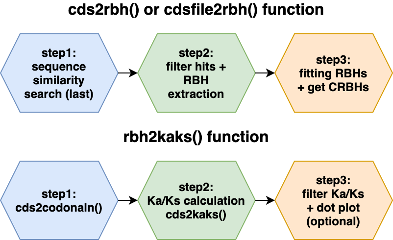

# Summary

[CRBHits](https://gitlab.gwdg.de/mpievolbio-it/crbhits) is a coding sequence (CDS) analysis pipeline in [R](https://cran.r-project.org/) 
[@team2013r]. It reimplements the Conditional Reciprocal Best Hit (CRBH) algorithm 
[crb-blast](https://github.com/cboursnell/crb-blast) and covers all necessary steps from sequence similarity searches, codon alignments to Ka/Ks calculations and synteny. The new R package targets ecology, population and evolutionary biologists working in the field of comparative genomics.

The Reciprocal Best Hit (RBH) approach is commonly used in bioinformatics to show that two 
sequences evolved from a common ancestral gene. In other words, RBH tries to find orthologous 
protein sequences within and between species. These orthologous sequences can be further 
analysed to evaluate protein family evolution, infer phylogenetic trees and to annotate 
protein function [@altenhoff2019inferring]. The initial sequence search step is classically 
performed with the Basic Local Alignment Search Tool (blast) [@altschul1990basic] and due to 
evolutionary constraints, in most cases protein coding sequences are compared between two 
species. Downstream analysis use the resulting RBH to cluster sequence pairs and build so-called 
orthologous groups like e.g. [OrthoFinder](https://github.com/davidemms/OrthoFinder) 
[@emms2015orthofinder] and other tools.

The CRBH algorithm was introduced by @aubry2014deep and builds upon the traditional 
RBH approach to find additional orthologous sequences between two sets of sequences. 
As described earlier [@aubry2014deep; @scott2017shmlast], CRBH uses the sequence search 
results to fit an expect value (E-value) cutoff given each RBH to subsequently add sequence pairs to the list of bona-fide orthologs given their alignment length.

Unfortunately, as mentioned by @scott2017shmlast, the original 
implementation of CRBH ([crb-blast](https://github.com/cboursnell/crb-blast)) lag improved 
blast-like search algorithm to speed up the analysis. As a consequence,
@scott2017shmlast ported CRBH to python [shmlast](https://github.com/camillescott/shmlast), 
while [shmlast](https://github.com/camillescott/shmlast) cannot deal with IUPAC nucleotide
code so far.

[CRBHits](https://gitlab.gwdg.de/mpievolbio-it/crbhits) constitutes a new R package, which 
build upon previous implementations and ports CRBH into the [R](https://cran.r-project.org/) 
environment, which is popular among biologists. 
[CRBHits](https://gitlab.gwdg.de/mpievolbio-it/crbhits) improve CRBH by additional implemented 
filter steps [@rost1999twilight] and the possibility to apply custom filters prior E-value fitting. Further, the resulting CRBH pairs can be evaluated for the presence of tandem duplicated genes, gene order based syntenic groups and evolutionary rates.



# Downstream functionalities

Calculating synonymous (Ks) and nonsynonymous substitutions (Ka) per orthologous sequence 
pair is a common task for evolutionary biologists, since its ratio Ka/Ks can be used as an 
indicator of selective pressure acting on a protein [@kryazhimskiy2008population]. However, 
this task is computational more demanding and consist of at least two steps, namely 
codon sequence alignment creation and Ka/Ks calculation. Further, the codon sequence alignment 
step consist of three subtasks, namely coding nucleotide to protein sequence translation, 
pairwise protein sequence alignment calculation and converting the protein 
sequence alignment back into a codon based alignment.

Downstream of CRBH creation, [CRBHits](https://gitlab.gwdg.de/mpievolbio-it/crbhits) features 
all above mentioned steps and subtasks. [CRBHits](https://gitlab.gwdg.de/mpievolbio-it/crbhits) 
has the ability to directly create codon alignments within R with the help of the widely used R 
package [Biostrings](https://bioconductor.org/packages/release/bioc/html/Biostrings.html) 
[@pages2017biostrings] (more than 200k downloads per year since 2014). These codon alignments 
can be subsequently used to calculate synonymous and nonsynonymous substitutions per sequence 
pair and is implemented in a multithreaded fashion either via the R package 
[seqinr](https://cran.r-project.org/web/packages/seqinr/index.html) [@charif2007seqinr] or the 
use of an R external tool 
[KaKs_Calculator2.0](https://sourceforge.net/projects/kakscalculator2/files/KaKs_Calculator2.0.tar.gz/download) [@wang2010kaks_calculator].

As gene duplication is one driving force in evolution [@ohno1970evolution], the classification of genes as duplicates is one important step to provide us with insights into the molecular events responsible for the current genome architecture of species [@haas2004]. New long-read sequencing technology make more and more chromosome scale assemblies for model and non-model species  available. The resulting chromosomal gene order information can be used with sequence similarity scores to classify genes into different types of duplication events, like tandem duplicates or chromosomal segments (syntenic regions) derived from e.g. whole-genome duplication. [CRBHits](https://gitlab.gwdg.de/mpievolbio-it/crbhits) features this classification step via the integration of the R external tool [DAGchainer](http://dagchainer.sourceforge.net/) [@haas2004] and offers the possibility to directly link it with evolutionary rate estimations (see \autoref{fig:synteny}).

# Implementation

Like [shmlast](https://github.com/camillescott/shmlast), 
[CRBHits](https://gitlab.gwdg.de/mpievolbio-it/crbhits) benefits from the blast-like sequence 
search software [LAST](http://last.cbrc.jp/)[@kielbasa2011adaptive] and plots the fitted model 
of the CRBH E-value based algorithm. In addition, users can filter the hit pairs prior to CRBH 
fitting for other criteria like query coverage, protein identity and/or 
the twilight zone of protein sequence alignments according to 
@rost1999twilight. The implemented filter uses equation 2 [see @rost1999twilight]:

$$f(x_{\text{hit pair}}) = \begin{cases}
100 \text{ , for } L_{\text{hit pair}} < 11 \\
480 * L^{-0.32 * (1 + e^{\frac{-L}{1000}})} \text{ , for } L_{\text{hit pair}} \leq 450 \\
19.5 \text{ , for } L_{\text{hit pair}} > 450
\end{cases}$$

where $x_{\text{hit pair}}$ is the expected protein identity given the alignment length $L_{\text{hit pair}}$. If the actual protein identity of a hit pair exceeds the expected protein identity ($pident_{\text{hit pair}} \geq f(x_{\text{hit pair}})$), it is retained for subsequent CRBH calculation.

In contrast to previous implementations, [CRBHits](https://gitlab.gwdg.de/mpievolbio-it/crbhits) only take coding nucleotide sequences (CDS) as the query and target inputs. This is due to the downstream functionality of [CRBHits](https://gitlab.gwdg.de/mpievolbio-it/crbhits) to directly calculate codon alignments within R, which rely on CDS. The inputs are translated into protein sequences, aligned globally [@smith1981identification] and converted into codon alignments. 

Functions are completely coded in R and only the external prerequisites 
([LAST](http://last.cbrc.jp/), [KaKs_Calculator2.0](https://sourceforge.net/projects/kakscalculator2/files/KaKs_Calculator2.0.tar.gz/download) and [DAGchainer](http://dagchainer.sourceforge.net/)) need to be compiled. However, all of them are forked within [CRBHits](https://gitlab.gwdg.de/mpievolbio-it/crbhits) and can be easily build with the dedicated R functions `make.last()`, `make.KaKs_Calculator2()` and `make.dagchainer()`. Further, users can create their own RBH filters before CRBH 
calculation.

# Functions and Examples

The following example shows how to obtain CRBHit pairs between the coding sequences of *Schizosaccharomyces pombe* (fission yeast) [@wood2012pombase] and *Nematostella vectensis* (starlet sea anemone) [@apweiler2004protein] by using two URLs as input strings and multiple threads for calculation.

```r
library(CRBHits)
#set URLs for Schizosaccharomyces pombe (fission yeast)
#and Nematostella vectensis (starlet sea anemone) from NCBI Genomes
cds1.url <- paste0("https://ftp.ncbi.nlm.nih.gov/genomes/all/GCF/000/002/945/",
               "GCF_000002945.1_ASM294v2/",
               "GCF_000002945.1_ASM294v2_cds_from_genomic.fna.gz")
cds2.url <- paste0("https://ftp.ncbi.nlm.nih.gov/genomes/all/GCF/000/209/225/",
               "GCF_000209225.1_ASM20922v1/",
               "GCF_000209225.1_ASM20922v1_cds_from_genomic.fna.gz")
#calculate CBRBhit pairs
cds1.cds2.crbh <- cdsfile2rbh(cds1.url, cds2.url, longest.isoform = TRUE,
                              isoform.source = "NCBI", plotCurve = TRUE,
                              threads = 8)
#get help ?cdsfile2rbh
```


The obtained CRBHit pairs can also be used to calculate synonymous (Ks) and nonsynonymous (Ka) substitutions per hit pair using either the model from @li1993unbiased or from @yang2000estimating.

```r
#download and simultaneously get longest isoform for
#Schizosaccharomyces pombe (fission yeast) and
#Nematostella vectensis (starlet sea anemone)
cds1 <- isoform2longest(Biostrings::readDNAStringSet(cds1.url))
cds2 <- isoform2longest(Biostrings::readDNAStringSet(cds2.url))
#calculate Ka/Ks values for each CRBHit pair
cds1.cds2.kaks.Li <- rbh2kaks(cds1.cds2.crbh, cds1, cds2,
                              model = "Li", threads = 8)
cds1.cds2.kaks.YN <- rbh2kaks(cds1.cds2.crbh, cds1, cds2,
                              model = "YN", threads = 8)
                              
#get help ?rbh2kaks
```

Given the annotated chromosomal gene positions it is also possible to assign tandem duplicated genes per chromosome and directly compute chains of syntenic genes via the use of the R external tool [DAGchainer](http://dagchainer.sourceforge.net/)[@haas2004]. Here, *Arabidopsis thaliana* is compared to itself (so called selfblast) and syntenic groups vsiualized by their Ks values.

```r
#download and simultaneously get longest isoform for
#Arabidopsis thaliana
cds3.url <- paste0("ftp://ftp.ensemblgenomes.org/pub/plants/release-48/fasta/",
               "arabidopsis_thaliana/cds/",
               "Arabidopsis_thaliana.TAIR10.cds.all.fa.gz")
cds3 <- isoform2longest(Biostrings::readDNAStringSet(cds3.url), "ENSEMBL")
#extract gene position and chromosomal gene order
cds3.genepos <- cds2genepos(cds3, source = "ENSEMBL")
#calculate CBRBhit pairs
cds3.selfblast.crbh <- cds2rbh(cds3, cds3, longest.isoform = TRUE,
                               qcov = 0.5, rost1999 = TRUE,
                               isoform.source = "ENSEMBL", plotCurve = TRUE,
                               threads = 8)
#compute chains of syntenic genes and plor chr1, chr2, chr3, chr4, chr5
cds3.selfblast.synteny <- rbh2dagchainer(cds3.selfblast.crbh,
                                         cds3.genepos, cds3.genepos,
                                         plotDotPlot = TRUE,
                                         select.chr = c("1", "2", "3", "4", "5"))
#calculate Ka/Ks values for each CRBHit pair
cds3.selfblast.kaks.Li <- rbh2kaks(cds3.selfblast.crbh, cds3, cds3,
                                   model = "Li", threads = 8)

#get help ?rbh2dagchainer
```


Table: Performance comparison for CRBHit pair (*Schizosaccharomyces pombe* vs. *Nematostella vectensis*) and Ka/Ks calculations (Intel Xeon CPU E5-2620 v3 @ 2.40GHz; 3575 hit pairs).\label{tab:performance}

| Number of Threads | 1 | 2 | 4 | 8 |
| - | - | - | - | - | 
| Runtime of CRBH(shmlast v1.6) in sec| 38 (s)| 25 (s) | 20 (s) | 16 (s) |
| Runtime of CRBH(CRBHits) in sec| 18 (s)| 10 (s) | 7 (s) | 6 (s) |
| Runtime of kaks.Li in sec| 357 (s)| 167 (s) | 87 (s) | 49 (s) | 
| Runtime of kaks.YN in sec| 474 (s)| 230 (s) | 121 (s) | 63 (s) |

# Conclusions

[CRBHits](https://gitlab.gwdg.de/mpievolbio-it/crbhits) implements CRBH in [R](https://cran.r-project.org/) (see \autoref{fig:crbh}), can be used to calculate codon alignment based nucleotide diversities (Ka/Ks) and synteny in a multithreaded fashion (see \autoref{tab:performance}).

# Availability

[CRBHits](https://gitlab.gwdg.de/mpievolbio-it/crbhits) is an open source software made available under the MIT license. It can be installed from its gitlab repository using the [devtools](https://devtools.r-lib.org) package.

```r
devtools::install_gitlab("mpievolbio-it/crbhits", 
 host = "https://gitlab.gwdg.de")", build_vignettes = TRUE)
```

The R package website, which contain a detailed HOWTO to install the prerequisites (mentioned above) and package vignettes are availbale at [https://mpievolbio-it.pages.gwdg.de/crbhits](https://mpievolbio-it.pages.gwdg.de/crbhits).

# References
