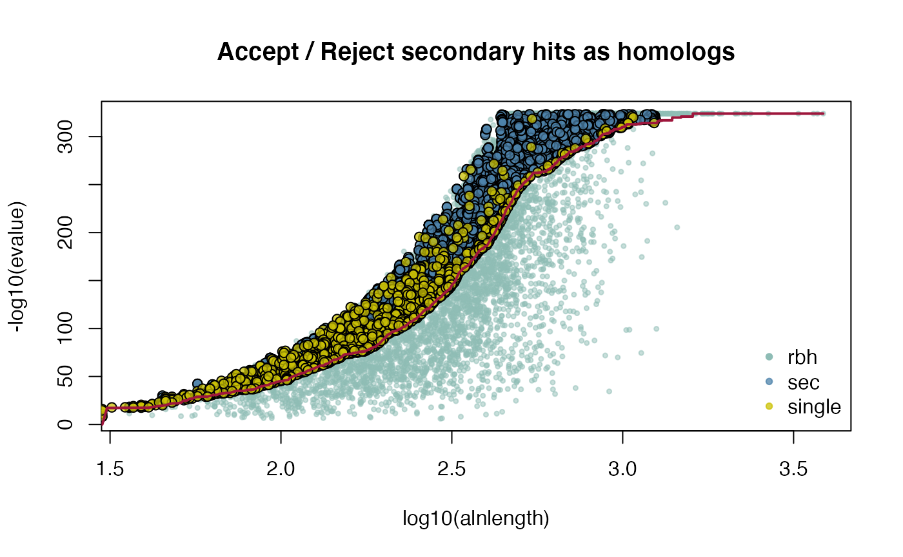
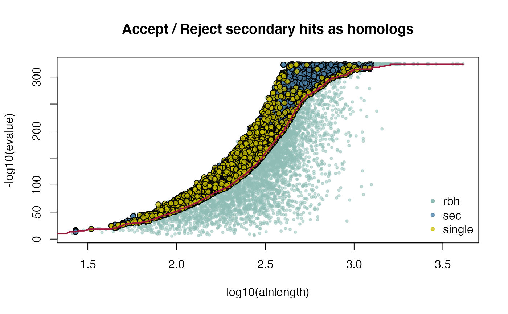

```{r setup, include = FALSE}
knitr::opts_chunk$set(
  collapse = TRUE,
  comment = "#>"
)
```

# Ka/Ks Vignette

- includes *Arabidopsis thalina* and *Arabidopsis lyrata* CRBHit pair calculation
- includes *Homo sapiens* and *Pan troglodytes* CRBHit pair calculation
- inlcudes Longest Isoform selection
- includes Gene/Isoform chromosomal position extraction
- includes Tandem Duplicate Assignment
- includes Synteny Assignment
- includes Ka/Ks colored Dot-Plot

## Table of Contents

1. [Conditional Reciprocal Best Hit pairs (CRBH pairs)](#crbhpairs)
    1. [Download Coding Sequences (CDS) from NCBI and ENSEMBL](#ensembl)
    2. [Get Longest Isoform from NCBI or ENSEMBL Input](#isoform)
        1. [isoform2longest()](#isoform2longest)
        2. [gtf2longest()](#gtf2longest)
        3. [gff2longest()](#gff2longest)
    3. [Calculate/Filter CRBHit pairs](#crbhfilter)
    4. [Extract Gene/Isoform chromosomal position](#extractposition)
        1. [Get gene position from NCBI or ENSEMBL Input](#ncbi2genepos)
        2. [Use GTF/GFF3 file to obtain gene position](#gff2genepos)
    5. [Assign Tandem Duplicates](#tandemduplicates)
    6. [Synteny with DAGchainer](#synteny)
2. [Ka/Ks Calculation](#KaKs)
3. [Ka/Ks Filtering and Visualisation](#KaKsFiltering)
4. [*Homo sapiens* vs. *Pan troglodytes* example](#homosapiens)
5. [References](#references)

This vignette is supposed to explain in more detail Ka/Ks calculation and it's
downstream filtering and visualization. The Ka/Ks ratio was originally
developed for the analysis of genetic sequences from divergent species
([Kimura (1977)](https://www.nature.com/articles/267275a0),
[Yang and Nielson (2000)]((https://doi.org/10.1093/oxfordjournals.molbev.a026236))).
In short, the Ka/Ks ratio quantifies the mode and strength of selection by
comparing synonymous substitution rates (Ks)
(assumed to be evolutionary neutral) with nonsynonymous rates (Ka), which are
exposed to selection as they change the amino acid composition of a protein
([Mugal et al (2014)](https://academic.oup.com/mbe/article/31/1/212/1049986)).

[CRBHits](https://gitlab.gwdg.de/mpievolbio-it/crbhits) is a reimplementation
of the Conditional Reciprocal Best Hit (CRBH) algorithm
[crb-blast](https://github.com/cboursnell/crb-blast) in R. The CRBHit pairs can
be directly used to calculate Ka/Ks ratios and to filter for tandem duplicates
or syntenic groups. 

See the R package page for a detailed description of the install process and
its dependencies
[https://mpievolbio-it.pages.gwdg.de/crbhits/](https://mpievolbio-it.pages.gwdg.de/crbhits/)
or have a look at the
[CRBHits Basic Vignette](https://mpievolbio-it.pages.gwdg.de/crbhits/articles/V01CRBHitsBasicVignette.html).

__Note:__

In this Vignette the `lastpath` is defined as `vignette.paths[1]`, the
`kakscalcpath` as `vignette.paths[2]` and the `dagchainerpath` as
`vignette.paths[3]` to be able to build the Vignette.

However, once you have compiled last-1256, KaKs_Calculator2.0 and DAGchainer
with the functions `make_last()`, `make_KaKs_Calculator2()` and
`make_dagchainer()` you won't need to specify the paths anymore. Please remove
them if you would like to repeat the examples.

```
## load vignette specific libraries
library(CRBHits)
suppressPackageStartupMessages(library(Biostrings))
suppressPackageStartupMessages(library(dplyr))
suppressPackageStartupMessages(library(ggplot2))
suppressPackageStartupMessages(library(gridExtra))
suppressPackageStartupMessages(library(curl))
## compile LAST, KaKs_Calculator2.0 and DAGchainer for the vignette
vignette.paths <- make_vignette()
```

## 1. [Conditional reciprocal best hit pairs]{#crbhpairs}

The CRBH algorithm builds upon the classical reciprocal best hit (RBH) approach
to find orthologous sequences between two sets of sequences by defining an
expect-value cutoff per alignment length. Further, this cutoff is used to
retain secondary hits as additional *bona-fide* homologues.

See the R package page and the
[CRBHits Basic Vignette](https://mpievolbio-it.pages.gwdg.de/crbhits/articles/V01CRBHitsBasicVignette.html)
for a more detailed description of the CRBH algorithm.

### 1.1. [Download Coding sequences (CDS) from NCBI and ENSEMBL]{#ensembl}

To calculate CRBHit pairs between two species, one can directly use an URL to
access the coding sequences and calculate the CRBH pairs matrix.

Two examples are given in this vignette.

The first example compares the coding sequences from *Arabidopsis thaliana* and
*Arabidopsis lyrata*. The input sequences are from the FTP server from
[NCBI Genomes](ftp://ftp.ncbi.nlm.nih.gov/genomes/all/).

The second example compares the CDS from *Homo sapiens* and *Pan troglodytes*
(see [*Homo sapiens* vs. *Pan troglodytes* example](#homosapiens)).

As an alternative the
[EnsemblPlants release-52](ftp://ftp.ensemblgenomes.org/pub/plants/release-52/fasta/)
can used.

```
## set URLs for Arabidopis thaliana and Arabidopsis lyrata from NCBI Genomes

## set NCBI URL
NCBI <- "https://ftp.ncbi.nlm.nih.gov/genomes/all/"
## set Arabidopsis thaliana CDS URL
ARATHA.cds.url <- paste0(NCBI, "GCF/000/001/735/GCF_000001735.4_TAIR10.1/",
    "GCF_000001735.4_TAIR10.1_cds_from_genomic.fna.gz")

## set Arabidopsis lyrata CDS URL
ARALYR.cds.url <- paste0(NCBI, "GCF/000/004/255/GCF_000004255.2_v.1.0/",
    "GCF_000004255.2_v.1.0_cds_from_genomic.fna.gz")
## get Arabidopsis thaliana CDS
ARATHA.cds <- Biostrings::readDNAStringSet(ARATHA.cds.url)
## get Arabidopsis lyrata CDS
ARALYR.cds <- Biostrings::readDNAStringSet(ARALYR.cds.url)
```

### 1.2. [Get Longest Isoform from NCBI or ENSEMBL Input]{#isoform}

Prior CRBHit pairs calculation, the longest isoforms can be selected, if the
data was downloaded from NCBI or Ensembl.

__Note:__ This is an important step. If e.g. isoforms are used, the Ka/Ks
calculations might show biased values inspecting mean or median Ka/Ks values
grouped per query sequence.

#### 1.2.1 [isoform2longest()]{#isoform2longest}

```
## get longest isoform from sequence IDs
ARATHA.cds.longest <- isoform2longest(ARATHA.cds, "NCBI")
ARALYR.cds.longest <- isoform2longest(ARALYR.cds, "NCBI")

## get help
#?cds2longest
```

#### 1.2.2 [gtf2longest()]{#gtf2longest}

__Note:__ Sometimes the sequence IDs do not have the necessary information to
extract the longest isoforms. If this might be the case, please use the
dedicated functions `gtf2longest()` or `gff2longest()` to get the gene positions
and the longest isoforms.

```
## get longest isoform from GTF file

## set Arabidopsis thaliana GTF URL
ARATHA.gtf.url <- paste0(NCBI, "GCF/000/001/735/GCF_000001735.4_TAIR10.1/",
    "GCF_000001735.4_TAIR10.1_genomic.gtf.gz")
ARALYR.gtf.url <- paste0(NCBI, "GCF/000/004/255/GCF_000004255.2_v.1.0/",
    "GCF_000004255.2_v.1.0_genomic.gtf.gz")

## get longest isoform from GTF file
ARATHA.gtf.longest <- gtf2longest(gtffile=ARATHA.gtf.url,
    cds=ARATHA.cds,
    removeNonCoding=TRUE,
    source="NCBI")
ARALYR.gtf.longest <- gtf2longest(gtffile=ARALYR.gtf.url,
    cds=ARALYR.cds,
    removeNonCoding=TRUE,
    source="NCBI")

ARATHA.cds.longest <- ARATHA.gtf.longest$cds
ARALYR.cds.longest <- ARALYR.gtf.longest$cds

## get help
#?gtf2longest
```

#### 1.2.3 [gff2longest()]{#gff2longest}

```
## get longest isoform from GFF3 file

## set Arabidopsis thaliana GFF3 URL
ARATHA.gff3.url <- paste0(NCBI, "GCF/000/001/735/GCF_000001735.4_TAIR10.1/",
    "GCF_000001735.4_TAIR10.1_genomic.gff.gz")
ARALYR.gff3.url <- paste0(NCBI, "GCF/000/004/255/GCF_000004255.2_v.1.0/",
    "GCF_000004255.2_v.1.0_genomic.gff.gz")

## get longest isoform from GTF file
ARATHA.gff3.longest <- gff2longest(gff3file=ARATHA.gff3.url,
    cds=ARATHA.cds,
    removeNonCoding=TRUE,
    source="NCBI")
ARALYR.gff3.longest <- gff2longest(gff3file=ARALYR.gff3.url,
    cds=ARALYR.cds,
    removeNonCoding=TRUE,
    source="NCBI")

ARATHA.cds.longest <- ARATHA.gff3.longest$cds
ARALYR.cds.longest <- ARALYR.gff3.longest$cds

## get help
#?gff2longest
```

### 1.3. [Calculate/Filter CRBHit pairs]{#crbhfilter}

The blast-like software [LAST](http://last.cbrc.jp/) is used to compare the
translated CDS against each other and output a blast-like output table
including the query and target length.

The hit pairs are filtered prior fitting for a query coverage of 50\% and the
**twilight zone of protein sequence alignments**
([Rost B. (1999)](https://academic.oup.com/peds/article/12/2/85/1550637)).

The CRBhit pairs can be calculated directly from the URLs with the function
`cdsfile2rbh()` using multiple threads including longest isoform selection.

For a detailed description of the `cdsfile2rbh()` function and the `cds2rbh()`
function with its individual filtering steps prior CRBH algorithm fitting see
the
[CRBHits Basic Vignette](https://mpievolbio-it.pages.gwdg.de/crbhits/articles/V01CRBHitsBasicVignette.html).

```
## calculate CRBHit pairs for A. thaliana and A. lyrata using 2 threads

## input from CDS obtained from NCBI
## longest isoform selection
## query coverage >= 50%
## rost199 filter
ARATHA_ARALYR_crbh <- cds2rbh(
    cds1=ARATHA.cds,
    cds2=ARALYR.cds,
    qcov=0.5,
    rost1999=TRUE,
    longest.isoform=TRUE,
    isoform.source="NCBI",
    threads=2,
    plotCurve=TRUE,
    lastpath=vignette.paths[1])
attributes(ARATHA_ARALYR_crbh)$selfblast

## get help
#?cds2rbh
```


### 1.4. [Extract Gene/Isoform chromosomal position]{#extractposition}

To be able to filter for *Tandem Duplicates* and to plot a dotplot, one needs
to have annotated gene positions per chromosome/contig. With the
`cds2genepos()` function it is possible to directly access this information if
the data was obtained from NCBI or Ensembl.

Chromosomal gene positions might overlap and if one has not filtered to use the
longest or primary isoform there will be positions overlap for CDS. To overcome
this issue it is recommended to first reduce the CDS Input to the longest
isoform (see [Get Longest Isoform from NCBI or ENSEMBL Input](#isoform)).

__Note:__ It is also possible to obtain and define chromosomal gene positions
from other sources, like parsing a GTF/GFF file and supply a manual curated
genepos matrix. In the same way this process might be used to select the
longest/primary isoform from CDS Input sources other than NCBI or Ensembl.
This special case is handled here: 

#### 1.4.1. [Get gene position from NCBI or ENSEMBL Input]{#ncbi2genepos}

If the CDS Input was obtained from NCBI or ENSEMBL, the gene position can be
directly extracted from the `DNAStringSet` as follows.

__Note:__ Sometimes the sequence IDs do not have the necessary information to
extract the longest isoforms. If this might be the case, please use the
dedicated functions `gtf2longest()` or `gff2longest()` to get the gene positions
and the longest isoforms.

```
## get gene position idx from NCBI CDS

## extract gene position from CDS directly from sequence IDs
ARATHA.cds.genepos <- cds2genepos(
    cds=ARATHA.cds,
    source="NCBI")
## extract gene position from longest isoform CDS
ARATHA.cds.longest.genepos <- cds2genepos(
    cds=ARATHA.cds.longest,
    source="NCBI")
## show first entries
head(ARATHA.cds.genepos)
head(ARATHA.cds.longest.genepos)
## get number of gene isoforms with same index
table(table(ARATHA.cds.genepos$gene.idx))
table(table(ARATHA.cds.longest.genepos$gene.idx))

##get help
#?cds2genepos
```

#### 1.4.2. [Use GTF/GFF3 file to obtain gene position]{#gff2genepos}

As noted above, it is also possible to obtain gene position and corresponding
the longest isoforms per gene annotated in a GTF/GFF3 file.

see [GTF/GFF3 format](http://www.ensembl.org/info/website/upload/gff3.html)

__Note:__ In some cases the IDs provided in the CDS and the GTF/GFF3 file
differ, which make it more complicated to directly link gene position and CDS.

Here, as an example, the GTF file for the species *Arabidopsis thaliana* is
obtained from the FTP server from
[Ensembl Plants](https://plants.ensembl.org/index.html).

__Note:__ The GTF and GFF3 files can be very large and it might take some time
until this data is loaded into memory.

```
## set ENSEMBL URL
ensemblPlants <- "http://ftp.ensemblgenomes.org/pub/plants/release-52/"
## set Arabidopsis thaliana GTF URL
ARATHA.ENSEMBL.GTF.url <- paste0(ensemblPlants,
    "/gtf/arabidopsis_thaliana/",
    "Arabidopsis_thaliana.TAIR10.52.gtf.gz")
## set Arabidopsis thaliana CDS URL
ARATHA.ENSEMBL.CDS.url <- paste0(ensemblPlants,
    "fasta/arabidopsis_thaliana/cds/",
    "Arabidopsis_thaliana.TAIR10.cds.all.fa.gz")
ARATHA.ENSEMBL.CDS <- Biostrings::readDNAStringSet(ARATHA.ENSEMBL.CDS.url)
ARATHA.ENSEMBL.CDS.longest <- gtf2longest(
    gtffile=ARATHA.ENSEMBL.GTF.url,
    cds=ARATHA.ENSEMBL.CDS,
    source="ENSEMBL")
ARATHA.ENSEMBL.CDS.longest$genepos
ARATHA.ENSEMBL.CDS.longest$cds
```

__Note:__ These manual steps (see below) are now deprecated, please use the
dedicated functions `gtf2longest()` or `gff2longest()`.

```
## deprecated, please use gtf2longest() or gff2longest function
## get gene position idx from GTF/GFF3

## set NCBI URL
ensemblPlants <- "ftp://ftp.ensemblgenomes.org/pub/plants/release-48/"
## set Arabidopsis thaliana GFF3 URL
ARATHA.GFF.url <- paste0(ensemblPlants, "gff3/arabidopsis_thaliana/",
    "Arabidopsis_thaliana.TAIR10.48.gff3.gz")
## downlaod and gunzip file
ARATHA.GFF.file <- tempfile()
ARATHA.GFF.file.gz <- paste0(ARATHA.GFF.file, ".gz")
download.file(ARATHA.GFF.url, ARATHA.GFF.file.gz, quiet=FALSE)
system2(command="gunzip", args=c("-f", ARATHA.GFF.file.gz))
## read ARATHA.GFF.file
ARATHA.gff <- read.table(ARATHA.GFF.file, sep="\t", 
    quote="", header=FALSE)
colnames(ARATHA.gff) <- c("seqname", "source", "feature", "start", "end",
    "score", "strand", "frame", "attribute")

## extract gene
ARATHA.gff.gene <- ARATHA.gff %>% dplyr::filter(feature=="gene")
## get gene ID
ARATHA.gff.gene.id <- gsub("ID\\=", "", 
    stringr::word(ARATHA.gff.gene$attribute, 1, sep=";"))
## extract mRNA
ARATHA.gff.mRNA <- ARATHA.gff %>% dplyr::filter(feature=="mRNA")
## get mRNA ID
ARATHA.gff.mRNA.id <- gsub("ID\\=", "", 
    stringr::word(ARATHA.gff.mRNA$attribute, 1, sep=";"))
## get mRNA based gene ID
ARATHA.gff.mRNA.parent.id <- gsub("Parent\\=", "", 
    stringr::word(ARATHA.gff.mRNA$attribute, 2, sep=";"))
## add mRNA ID and mRNA based gene ID
ARATHA.gff.mRNA <- ARATHA.gff.mRNA %>% 
    dplyr::mutate(gene.id=ARATHA.gff.mRNA.parent.id,
    mRNA.id=ARATHA.gff.mRNA.id)
## extract CDS
ARATHA.gff.CDS <- ARATHA.gff %>% dplyr::filter(feature=="CDS")
## get CDS based mRNA ID
ARATHA.gff.CDS.parent.id <- gsub("Parent\\=", "", 
    stringr::word(ARATHA.gff.CDS$attribute, 2, sep=";"))
## add CDS based mRNA ID
ARATHA.gff.CDS <- ARATHA.gff.CDS %>%
    dplyr::mutate(mRNA.id=ARATHA.gff.CDS.parent.id)
## get width per mRNA isoform
ARATHA.gff.mRNA.len <- ARATHA.gff.CDS %>% dplyr::group_by(mRNA.id) %>%
    dplyr::summarise(mRNA.id=unique(mRNA.id),
    len=sum(end-start+1))
## add mRNA isoform width
ARATHA.gff.mRNA <- ARATHA.gff.mRNA %>% 
    dplyr::mutate(mRNA.len= 
    ARATHA.gff.mRNA.len$len[
    match(ARATHA.gff.mRNA$mRNA.id, 
    ARATHA.gff.mRNA.len$mRNA.id)])
## retain only longest mRNA isoform
ARATHA.gff.mRNA.longest <- ARATHA.gff.mRNA %>%
    dplyr::arrange(seqname, desc(mRNA.len), mRNA.id, gene.id, start) %>%
    dplyr::distinct(gene.id, .keep_all=TRUE) %>% 
    dplyr::mutate(gene.mid=start + (end-start)/2)
## add gene idx
ARATHA.gff.mRNA.longest <- ARATHA.gff.mRNA.longest %>% 
  dplyr::mutate(gene.idx=seq(from=1, to=dim(ARATHA.gff.mRNA.longest)[1]))
## create gene position matrix to be used for downstream analysis
ARATHA.gff.genepos <- ARATHA.gff.mRNA.longest %>%
    dplyr::select(
    gene.seq.id=mRNA.id,
    gene.chr=seqname,
    gene.start=start,
    gene.end=end,
    gene.mid=gene.mid,
    gene.strand=strand,
    gene.idx=gene.idx)
## set attribute
attr(ARATHA.gff.genepos, "CRBHits.class") <- "genepos"
## show first entries of generated gene position
head(ARATHA.gff.genepos)
```

### 1.5 [Assign Tandem Duplicates]{#tandemduplicates}

Tandem duplicated genes (gene family members that are tightly clustered on a
chromosome) are common in plant genomes and can show different Ka/Ks
distribution than non tandem duplicates or other segmental duplicated genes
([Rizzon et al., 2006](https://journals.plos.org/ploscompbiol/article?id=10.1371/journal.pcbi.0020115)).

In order to account for this, it is possible to classify these tandem
duplicates with the `tandemdups()` function.

__Note:__ To be able to classify tandem duplicated genes within one genome, one
needs to calculate selfblast based CRBHit pairs and provide gene position
information for the same input data.

The following example shows how one can:

1. get selfblast CRBHit pairs
2. get gene positions
3. assign tandem duplicates

```
## example to assign tandem duplicates given selfblast CRBHit pairs and gene position

## get selfblast CRBHit pairs for A. thaliana
ARATHA_selfblast_crbh <- cds2rbh(
    cds1=ARATHA.cds,
    cds2=ARATHA.cds,
    qcov=0.5,
    rost1999=TRUE,
    longest.isoform=TRUE,
    isoform.source="NCBI",
    threads=2,
    plotCurve=TRUE,
    lastpath=vignette.paths[1])
attributes(ARATHA_selfblast_crbh)$selfblast
```



```
## get selfblast CRBHit pairs for A. lyrata
ARALYR_selfblast_crbh <- cds2rbh(
    cds1=ARALYR.cds,
    cds2=ARALYR.cds,
    qcov=0.5,
    rost1999=TRUE,
    longest.isoform=TRUE,
    isoform.source="NCBI",
    threads=2,
    plotCurve=TRUE,
    lastpath=vignette.paths[1])
attributes(ARALYR_selfblast_crbh)$selfblast
```



```
## get gene position for A. thaliana longest isoforms
ARATHA.cds.longest.genepos <- cds2genepos(
    cds=ARATHA.cds.longest,
    source="NCBI")
## get gene position for A. lyrata longest isoforms
ARALYR.cds.longest.genepos <- cds2genepos(
    cds=ARALYR.cds.longest,
    source="NCBI")

## assign tandem duplicates for A. thaliana
ARATHA.cds.longest.tandemdups <- tandemdups(
    rbhpairs=ARATHA_selfblast_crbh,
    genepos=ARATHA.cds.longest.genepos,
    dupdist=5)

## assign tandem duplicates for A. lyrata
ARALYR.cds.longest.tandemdups <- tandemdups(
    rbhpairs=ARALYR_selfblast_crbh,
    genepos=ARALYR.cds.longest.genepos,
    dupdist=5)
## get help
#?tandemdups
```

The resulting tandem duplicated genes detected can be plotted given their
chromosomal gene position as follows:

```
## example how to plot tandem duplicated gene groups

## get tandem group size
tandem_group_size <- ARATHA.cds.longest.tandemdups %>%
    dplyr::group_by(tandem_group) %>%
    dplyr::group_size()
table(tandem_group_size)

## use dplyr::mutate to assign group size
ARATHA.cds.longest.tandemdups <- ARATHA.cds.longest.tandemdups %>%
    dplyr::mutate(tandem_group_size=unlist(apply(cbind(tandem_group_size,
    tandem_group_size), 1, function(x) rep(x[1], x[2]))))

## use dplyr::group_by to plot group by chromosome and colored by group size
ARATHA.cds.longest.tandemdups %>%
    dplyr::group_by(gene.chr) %>%
    ggplot2::ggplot(aes(x=gene.mid, y=gene.mid)) +
    ggplot2::geom_point(shape=20, aes(col=as.factor(tandem_group_size))) +
    ggplot2::facet_wrap(~gene.chr) +
    ggplot2::scale_colour_manual(values=
    CRBHitsColors(length(table(tandem_group_size))))
```


### 1.6 [Synteny with DAGchainer]{#synteny}

Chains of collinear gene pairs can represent segmentally duplicated regions and
genes within a single genome or syntenic regions between related genomes
([Haas et al., 2004](https://doi.org/10.1093/bioinformatics/bth397)).

There exists external tools which can be used to infer syntenic regions,
like e.g. [SynMap](https://genomevolution.org/CoGe/SynMap.pl) as published by
[Haug-Baltzell A. et al., 2017 ](https://academic.oup.com/bioinformatics/article/33/14/2197/3072872).

Within CRBHits the tool [DAGchainer](http://dagchainer.sourceforge.net/)
published by [Haas et al., 2004](https://doi.org/10.1093/bioinformatics/bth397)
can be directly applied on the CRBHit pairs.

The following example shows how one can run
[DAGchainer](http://dagchainer.sourceforge.net/) on CRBHit pairs and gene
positions to get syntenic information about the CRBHit pairs.

```
## example how to run DAGchainer on CRBHit pairs and gene positions

## DAGchainer using gene base pair (gene bp start end)
## Note: change parameter to fit bp option
ARATHA_ARALYR_crbh.dagchainer.bp <- rbh2dagchainer(
    rbhpairs=ARATHA_ARALYR_crbh, 
    gene.position.cds1=ARATHA.cds.longest.genepos,
    gene.position.cds2=ARALYR.cds.longest.genepos,
    type="bp",
    gap_length=10000,
    max_dist_allowed=200000,
    dagchainerpath=vignette.paths[3])

## DAGchainer using gene index (gene order)
ARATHA_ARALYR_crbh.dagchainer.idx <- rbh2dagchainer(
    rbhpairs=ARATHA_ARALYR_crbh, 
    gene.position.cds1=ARATHA.cds.longest.genepos,
    gene.position.cds2=ARALYR.cds.longest.genepos,
    type="idx",
    gap_length=1,
    max_dist_allowed=20,
    dagchainerpath=vignette.paths[3])

## get help
#?rbh2dagchainer
```

A plotting function `plot_dagchainer()` is integrated and can be directly
applied on the DAGchainer results.

```
## example how to plot pairwise chromosomal syntenic groups (DAGchainer results)

## plot DAGchainer results for each chromosome combination
dim(ARATHA_ARALYR_crbh.dagchainer.bp)
plot_dagchainer(ARATHA_ARALYR_crbh.dagchainer.bp)
```


```
## plot DAGchainer results selected chromosomes
g <- plot_dagchainer(
    dag=ARATHA_ARALYR_crbh.dagchainer.bp,
    select.chr=c(
    "AA1:NC_003070.9", "AA1:NC_003071.7", "AA1:NC_003074.8",
    "AA1:NC_003075.7", "AA1:NC_003076.8",
    "AA2:NW_003302551.1", "AA2:NW_003302554.1",
    "AA2:NW_003302553.1", "AA2:NW_003302552.1",
    "AA2:NW_003302551.1", "AA2:NW_003302550.1",
    "AA2:NW_003302549.1", "AA2:NW_003302548.1"))
g
```


```
## change title size
g + ggplot2::theme(title=element_text(size=16))
```


```
## change axis title size (gene1.mid; gene2.mid)
g + ggplot2::theme(axis.title.x=element_text(size=16),
    axis.title.y=element_text(size=16))
```


```
## change grid title size
g + theme(strip.text.x=element_text(size=16), strip.text.y=element_text(size=16))
```


```
## change grid axis size and angle
g + theme(axis.text.x=element_text(size=12, angle=90))
```


```
## get help
#?plot_dagchainer
```

The same analysis can be done just using the selfblast hits of one species.

```
## example how to run DAGchainer on CRBHit pairs and gene positions

## DAGchainer using gene base pair (gene bp start end)
## ignore tandem duplicates
## Note: change parameter to fit bp option
ARATHA_selfblast_crbh.dagchainer.ignore_tandem.bp <- rbh2dagchainer(
    rbhpairs=ARATHA_selfblast_crbh, 
    gene.position.cds1=ARATHA.cds.longest.genepos,
    gene.position.cds2=ARATHA.cds.longest.genepos,
    type="bp",
    gap_length=10000,
    max_dist_allowed=200000,
    ignore_tandem=TRUE,
    only_tandem=FALSE,
    dagchainerpath=vignette.paths[3])

## DAGchainer using gene base pair (gene bp start end)
## use tandem duplicates
## Note: change parameter to fit bp option
ARATHA_selfblast_crbh.dagchainer.tandem.bp <- rbh2dagchainer(
    rbhpairs=ARATHA_selfblast_crbh, 
    gene.position.cds1=ARATHA.cds.longest.genepos,
    gene.position.cds2=ARATHA.cds.longest.genepos,
    type="bp",
    gap_length=10000,
    max_dist_allowed=200000,
    ignore_tandem=FALSE,
    only_tandem=FALSE,
    dagchainerpath=vignette.paths[3])

## DAGchainer using gene base pair (gene bp start end)
## use only tandem duplicates
## Note: change parameter to fit bp option
ARATHA_selfblast_crbh.dagchainer.only_tandem.bp <- rbh2dagchainer(
    rbhpairs=ARATHA_selfblast_crbh, 
    gene.position.cds1=ARATHA.cds.longest.genepos,
    gene.position.cds2=ARATHA.cds.longest.genepos,
    type="bp",
    gap_length=10000,
    max_dist_allowed=200000,
    ignore_tandem=FALSE,
    only_tandem=TRUE,
    dagchainerpath=vignette.paths[3])

## get help
#?rbh2dagchainer
```

```
## example how to plot pairwise chromosomal syntenic groups for selfblast (DAGchainer results)

## plot DAGchainer results for each chromosome combination
dim(ARATHA_selfblast_crbh.dagchainer.ignore_tandem.bp)
plot_dagchainer(ARATHA_selfblast_crbh.dagchainer.ignore_tandem.bp,
    DotPlotTitle="ignore tandem duplicates")
dim(ARATHA_selfblast_crbh.dagchainer.tandem.bp)
plot_dagchainer(ARATHA_selfblast_crbh.dagchainer.tandem.bp,
    DotPlotTitle="use tandem duplicates")
dim(ARATHA_selfblast_crbh.dagchainer.only_tandem.bp)
plot_dagchainer(ARATHA_selfblast_crbh.dagchainer.only_tandem.bp,
    DotPlotTitle="use only tandem duplicates")
```


It is even possible to do the same analysis and use the inter and intra
species hits.

```
## example how to run DAGchainer on CRBHit pairs
## and gene positions using inter and intra species hits

## DAGchainer using gene base pair (gene bp start end)
## ignore tandem duplicates
## Note: change parameter to fit bp option
ARATHA_ARALYR_crbh.dagchainer.ignore_tandem.bp <- rbh2dagchainer(
    rbhpairs=ARATHA_ARALYR_crbh, 
    selfblast1=ARATHA_selfblast_crbh,
    selfblast2=ARALYR_selfblast_crbh,
    gene.position.cds1=ARATHA.cds.longest.genepos,
    gene.position.cds2=ARALYR.cds.longest.genepos,
    type="bp",
    gap_length=10000,
    max_dist_allowed=200000,
    ignore_tandem=TRUE,
    only_tandem=FALSE,
    dagchainerpath=vignette.paths[3])

## DAGchainer using gene base pair (gene bp start end)
## use tandem duplicates
## Note: change parameter to fit bp option
ARATHA_ARALYR_crbh.dagchainer.tandem.bp <- rbh2dagchainer(
    rbhpairs=ARATHA_ARALYR_crbh, 
    selfblast1=ARATHA_selfblast_crbh,
    selfblast2=ARALYR_selfblast_crbh,
    gene.position.cds1=ARATHA.cds.longest.genepos,
    gene.position.cds2=ARALYR.cds.longest.genepos,
    type="bp",
    gap_length=10000,
    max_dist_allowed=200000,
    ignore_tandem=FALSE,
    only_tandem=FALSE,
    dagchainerpath=vignette.paths[3])
    
## DAGchainer using gene base pair (gene bp start end)
## use only tandem duplicates
## Note: change parameter to fit bp option
ARATHA_ARALYR_crbh.dagchainer.only_tandem.bp <- rbh2dagchainer(
    rbhpairs=ARATHA_ARALYR_crbh, 
    selfblast1=ARATHA_selfblast_crbh,
    selfblast2=ARALYR_selfblast_crbh,
    gene.position.cds1=ARATHA.cds.longest.genepos,
    gene.position.cds2=ARALYR.cds.longest.genepos,
    type="bp",
    gap_length=10000,
    max_dist_allowed=200000,
    ignore_tandem=FALSE,
    only_tandem=TRUE,
    dagchainerpath=vignette.paths[3])

## get help
#?rbh2dagchainer
```

```
## example how to plot pairwise chromosomal syntenic groups
## for inter and intra species hits (DAGchainer results)

## plot DAGchainer results for each chromosome combination
dim(ARATHA_ARALYR_crbh.dagchainer.ignore_tandem.bp)
plot_dagchainer(ARATHA_ARALYR_crbh.dagchainer.ignore_tandem.bp,
    DotPlotTitle="inter and intra species hits - ignore tandem duplicates")
dim(ARATHA_ARALYR_crbh.dagchainer.tandem.bp)
plot_dagchainer(ARATHA_ARALYR_crbh.dagchainer.tandem.bp,
    DotPlotTitle="inter and intra species hits - use tandem duplicates")
dim(ARATHA_ARALYR_crbh.dagchainer.only_tandem.bp)
plot_dagchainer(ARATHA_ARALYR_crbh.dagchainer.only_tandem.bp,
    DotPlotTitle="inter and intra species hits - use only tandem duplicates")
```


## 2. [Ka/Ks Calculation]{#KaKs}

The second part of this vignette describes how to calculate synonymous (Ks) and
nonsynonymous substitution rates (Ka) given a set of CRBHit pairs
(see [Calculate/Filter CRBHit pairs](#crbhfilter) section how to obtain
CRBHit pairs).

The `rbh2kaks()` function is used to obtain pairwise codon alignments and
directly calculate synonymous (Ks) and nonsynonymous (Ka) substitutions in a
parallel fashion. One can choose either to use the model by
[Li (1993)](https://doi.org/10.1007/bf02407308) or the model by
[Yang and Nielson (2000)](https://doi.org/10.1093/oxfordjournals.molbev.a026236).

__Note:__

It is important, that the names of the `rbh` columns must match the names of
the corresponding `cds1` and `cds2` `DNAStringSet` vectors.

However, since one should directly use the same input `DNAStringSet` vector or
input `url` to calculate the CRBHit pairs with the `cds2rbh()` or the
`cdsfile2rbh()` function, this should not be a problem
(see the [Get Longest Isoform from NCBI or ENSEMBL Input](#isoform) section
how to obtain the CDS for the next example).
 
To calculate Ka/Ks values based on the model by
[Li (1993)](https://doi.org/10.1007/bf02407308), do the following:

__Note:__ The following example can take some time and is not calculated by the
vignette building process.

```
## example how to calculate Ka/Ks values with model "Li"

## calculate Ka/Ks using the CRBHit pairs and multiple threads
ARATHA_ARALYR_crbh.kaks.Li <- rbh2kaks(
    rbhpairs=ARATHA_ARALYR_crbh,
    cds1=ARATHA.cds.longest,
    cds2=ARALYR.cds.longest,
    model="Li",
    threads=4)
```

To calculate Ka/Ks values based on the model by
[Yang and Nielson (2000)](https://doi.org/10.1093/oxfordjournals.molbev.a026236),
do the following:

__Note:__ The following example can take some time and is not calculated by the
vignette building process.

```
## example how to calculate Ka/Ks values with model "YN"

## calculate Ka/Ks using the CRBHit pairs and multiple threads
ARATHA_ARALYR_crbh.kaks.YN <- rbh2kaks(
    rbhpairs=ARATHA_ARALYR_crbh,
    cds1=ARATHA.cds.longest,
    cds2=ARALYR.cds.longest,
    model="YN",
    threads=4)
```

## 3. [Ka/Ks Filtering and Visualisation]{#KaKsFiltering}

In some cases the Ka/Ks calculation fails, since e.g. there are no synonymous
(Ks) or nonsynonymous substitutions (Ka) between cds1 and cds2 or one wants to
get rid of high Ks values due to substitution saturation. One can easily remove
these cases before doing further analysis.

A plotting function `plot_kaks()` is integrated and can be applied on the
Ka/Ks results. 

```
## load example Ka/Ks values (see above commands above how to obtain them)
data("ath_aly_ncbi_kaks", package="CRBHits")

## plot Ka/Ks results as histogram colored by Ka/Ks values
g <- plot_kaks(kaks=ath_aly_ncbi_kaks)
```


```
## plot Ka/Ks results as histogram filter for ka.min, ka.max, ks.min, ks.max
g.min_max <- plot_kaks(
    kaks=ath_aly_ncbi_kaks,
    ka.min=0,
    ka.max=1,
    ks.min=0,
    ks.max=1)
```


```
## select subset of chromosomes - needs gene position information
head(ARATHA.cds.longest.genepos)
head(ARALYR.cds.longest.genepos)
g.subset <- plot_kaks(
    kaks=ath_aly_ncbi_kaks,
    gene.position.cds1=ARATHA.cds.longest.genepos,
    gene.position.cds2=ARALYR.cds.longest.genepos,
    select.chr=c(
    "NC_003070.9",
    "NC_003071.7",
    "NW_003302551.1",
    "NW_003302554.1"))
```


```
## plot Ka/Ks results and split by chromosome - needs gene position information

g.split <- plot_kaks(
    kaks=ath_aly_ncbi_kaks,
    gene.position.cds1=ARATHA.cds.longest.genepos,
    gene.position.cds2=ARALYR.cds.longest.genepos,
    select.chr=c(
    "NC_003070.9",
    "NC_003071.7",
    "NW_003302551.1",
    "NW_003302554.1"),
    splitByChr=TRUE)
```


__Note:__ Default **data.frame** handling with the **dplyr** package is
possible on the original Ka/Ks results as well as on the resulting plot objects.

Apply `dplyr::filter()` and `dplyr::mutate()` function:

```
## examples how to filter and mutate Ka/Ks results

## filter for Ks values < 2 on original Ka/Ks results
head(ath_aly_ncbi_kaks)
dim(ath_aly_ncbi_kaks)
dim(ath_aly_ncbi_kaks %>% dplyr::filter(ks<2))

## filter for Ks values < 2 on plot object
head(g.split$g.kaks$data)
dim(g.split$g.kaks$data)
dim(g.split$g.kaks$data %>% dplyr::filter(ks<2))

## filter for Ks values < 1 on plot object and plot
g.split$g.kaks$data %>% dplyr::filter(ks<1) %>%
    ggplot2::ggplot() + ggplot2::geom_histogram(binwidth=0.1, aes(x=ks))
```


## 4. [*Homo sapiens* vs. *Pan troglodytes* example]{#homosapiens}

The second example compares the CDS from *Homo sapiens* and *Pan troglodytes*.
The input sequences are from the FTP server from
[Ensembl](https://ensembl.org/index.html).

The [Ensembl release-101](ftp://ftp.ensembl.org/pub/release-101/fasta/) is used.

```
## example comparing Homo sapiens and Pan troglodytes

## set URLs for Homo sapiens and Pan troglodytes from Ensembl

## set Ensembl URL
ensembl <- "ftp://ftp.ensembl.org/pub/release-105/fasta/"
## set Homo sapiens CDS URL
HOMSAP.cds.url <- paste0(ensembl,
    "homo_sapiens/cds/Homo_sapiens.GRCh38.cds.all.fa.gz")
## set Pan troglodytes CDS URL
PANTRO.cds.url <- paste0(ensembl,
    "pan_troglodytes/cds/Pan_troglodytes.Pan_tro_3.0.cds.all.fa.gz")

## get Homo sapiens CDS
HOMSAP.cds.file <- tempfile()
download.file(HOMSAP.cds.url, HOMSAP.cds.file, quiet = FALSE)
HOMSAP.cds <- Biostrings::readDNAStringSet(HOMSAP.cds.file)

## get Pan troglodytes CDS
PANTRO.cds.file <- tempfile()
download.file(PANTRO.cds.url, PANTRO.cds.file, quiet = FALSE)
PANTRO.cds <- Biostrings::readDNAStringSet(PANTRO.cds.file)

## get longest isoform
HOMSAP.cds.longest <- isoform2longest(HOMSAP.cds, "ENSEMBL")
PANTRO.cds.longest <- isoform2longest(PANTRO.cds, "ENSEMBL")

## calculate CRBHit pairs for H. sapiens and P. troglodytes using 2 threads

## input from CDS obtained from Ensembl
## longest isoform selection
## query coverage >= 50%
## rost199 filter
HOMSAP_PANTRO_crbh <- cds2rbh(
    cds1=HOMSAP.cds,
    cds2=PANTRO.cds,
    qcov=0.5,
    rost1999=TRUE,
    longest.isoform=TRUE,
    isoform.source="ENSEMBL",
    threads=2,
    plotCurve=TRUE,
    lastpath=vignette.paths[1])
```


```
## get gene position for H. sapiens longest isoforms
HOMSAP.cds.longest.genepos <- cds2genepos(
    cds=HOMSAP.cds.longest, 
    source="ENSEMBL")
## get gene position for P. troglodytes longest isoforms
PANTRO.cds.longest.genepos <- cds2genepos(
    cds=PANTRO.cds.longest,
    source="ENSEMBL")

## DAGchainer using gene base pair (gene bp start end)
## Note: change parameter to fit bp option
HOMSAP_PANTRO_crbh.dagchainer.bp <- rbh2dagchainer(
    rbhpairs=HOMSAP_PANTRO_crbh, 
    gene.position.cds1=HOMSAP.cds.longest.genepos,
    gene.position.cds2=PANTRO.cds.longest.genepos,
    type="bp",
    gap_length=10000,
    max_dist_allowed=200000,
    dagchainerpath=vignette.paths[3])

## plot DAGchainer results for selected chromosome combinations
plot_dagchainer(
    dag=HOMSAP_PANTRO_crbh.dagchainer.bp,
    select.chr=c(
    "AA1:1","AA1:2","AA1:3","AA1:4","AA1:5","AA1:14",
    "AA2:1","AA2:3","AA2:4","AA2:5","AA2:14"))
```


```
## get selfblast CRBHit pairs for H. sapiens
HOMSAP_selfblast_crbh <- cds2rbh(
    cds1=HOMSAP.cds,
    cds2=HOMSAP.cds,
    qcov=0.5,
    rost1999=TRUE,
    longest.isoform=TRUE,
    isoform.source="ENSEMBL",
    threads=2,
    plotCurve=FALSE,
    lastpath=vignette.paths[1])
PANTRO_selfblast_crbh <- cds2rbh(
    cds1=PANTRO.cds,
    cds2=PANTRO.cds,
    qcov=0.5,
    rost1999=TRUE,
    longest.isoform=TRUE,
    isoform.source="ENSEMBL",
    threads=2,
    plotCurve=FALSE,
    lastpath=vignette.paths[1])
```

```
## example how to run DAGchainer on CRBHit pairs
## and gene positions using inter and intra species hits

## DAGchainer using gene base pair (gene bp start end)
## use tandem duplicates
## Note: change parameter to fit bp option
HOMSAP_PANTRO_crbh.dagchainer.tandem.bp <- rbh2dagchainer(
    rbhpairs=HOMSAP_PANTRO_crbh, 
    selfblast1=HOMSAP_selfblast_crbh,
    selfblast2=PANTRO_selfblast_crbh,
    gene.position.cds1=HOMSAP.cds.longest.genepos,
    gene.position.cds2=PANTRO.cds.longest.genepos,
    type="bp",
    gap_length=10000,
    max_dist_allowed=200000,
    ignore_tandem=FALSE,
    only_tandem=FALSE,
    dagchainerpath=vignette.paths[3])

## plot DAGchainer results for selected chromosome combinations
plot_dagchainer(
    dag=HOMSAP_PANTRO_crbh.dagchainer.tandem.bp,
    select.chr=c(
    "AA1:1","AA1:2","AA1:3","AA1:4","AA1:5","AA1:14",
    "AA2:1","AA2:3","AA2:4","AA2:5","AA2:14"))
```


__Note:__ The following example can take some time and is not calculated by
the vignette building process.

```
## example how to calculate Ka/Ks values with model "Li"

## calculate Ka/Ks using the CRBHit pairs and multiple threads
HOMSAP_PANTRO_crbh.kaks.Li <- rbh2kaks(
    rbhpairs=HOMSAP_PANTRO_crbh,
    cds1=HOMSAP.cds.longest,
    cds2=PANTRO.cds.longest,
    model="Li",
    threads=4)
```

```
## load example Ka/Ks values (see above commands above how to obtain them)
data("hom_pan_ensembl_kaks", package="CRBHits")

## plot Ka/Ks results as histogram colored by Ka/Ks values
g <- plot_kaks(hom_pan_ensembl_kaks)
```


## 5. [References]{#references}

Aubry S., Kelly S., Kümpers B. M., Smith-Unna R. D., and Hibberd J. M. (2014). **Deep evolutionary comparison of gene expression identifies parallel recruitment of trans-factors in two independent origins of C4 photosynthesis.** *PLoS Genetics*, **10(6)**. [https://doi.org/10.1371/journal.pgen.1004365](https://doi.org/10.1371/journal.pgen.1004365)

Charif D., and Lobry J. R. (2007). **SeqinR 1.0-2: a contributed package to the R project for statistical computing devoted to biological sequences retrieval and analysis.** *In Structural approaches to sequence evolution* (pp. 207-232). Springer, Berlin, Heidelberg. [https://link.springer.com/chapter/10.1007/978-3-540-35306-5_10](https://link.springer.com/chapter/10.1007/978-3-540-35306-5_10)

Duong T., and Wand M. (2015). **feature: Local Inferential Feature Significance for Multivariate Kernel Density Estimation.** *R package version 1.2.13*. [https://cran.r-project.org/web/packages/feature/](https://cran.r-project.org/web/packages/feature/)

Haas B. J., Delcher A. L., Wortman J. R., and Salzberg S. L. (2004). **DAGchainer: a tool for mining segmental genome duplications and synteny.** *Bioinformatics*, **20(18)**, 3643-3646. [https://doi.org/10.1093/bioinformatics/bth397](https://doi.org/10.1093/bioinformatics/bth397)

Haug-Baltzell A., Stephens S. A., Davey S., Scheidegger C. E., Lyons E. (2017). **SynMap2 and SynMap3D: web-based wholge-genome synteny browsers.** *Bioinformatics*, **33(14)**, 2197-2198. [https://academic.oup.com/bioinformatics/article/33/14/2197/3072872](https://academic.oup.com/bioinformatics/article/33/14/2197/3072872)

Kiełbasa S. M., Wan R., Sato K., Horton P., and Frith M. C. (2011). **Adaptive seeds tame genomic sequence comparison.** *Genome Research*, **21(3)**, 487-493. [https://doi.org/10.1101/gr.113985.110](https://doi.org/10.1101/gr.113985.110)

Kimura M. (1977). **Preponderance of synonymous changes as evidence for the neutral theory of molecular evolution.** *Nature*, **267**, 275-276.

Li W. H. (1993). **Unbiased estimation of the rates of synonymous and nonsynonymous substitution.** *Journal of Molecular Evolution*, **36(1)**, 96-99. [https://doi.org/10.1007/bf02407308](https://doi.org/10.1007/bf02407308)

Microsoft, and Weston S. (2020). **foreach: Provides Foreach Looping Construct.** *R package version*, 1.5.1. [foreach](https://cran.r-project.org/web/packages/foreach/index.html)

Mugal C. F., Wolf J. B. W., Kaj I. (2014). **Why Time Matters: Codon Evolution and the Temproal Dynamics of dN/dS.** *Molecular Biology and Evolution*, **31(1)**, 212-231.

Ooms J. (2019). **curl: A Modern and Flexible Web Client for R.** *R package version*, 4.3. [curl](https://cran.r-project.org/web/packages/curl/index.html)

Pagès H., Aboyoun P., Gentleman R., and DebRoy S. (2017). **Biostrings: Efficient manipulation of biological strings.** *R package version*, 2.56.0. [Biostrings](http://bioconductor.org/packages/release/bioc/html/Biostrings.html)

Revolution Analytics, and Weston S. (2020). **doMC: Foreach Parallel Adaptor for 'parallel'.** *R package version*, 1.3.7. [doMC](https://cran.r-project.org/web/packages/doMC/index.html)

Rost B. (1999). **Twilight zone of protein sequence alignments.** *Protein Engineering*, **12(2)**, 85-94. [https://doi.org/10.1093/protein/12.2.85](https://doi.org/10.1093/protein/12.2.85)

Scott C. (2017). **shmlast: an improved implementation of conditional reciprocal best hits with LAST and Python.** *Journal of Open Source Software*, **2(9)**, 142. [https://joss.theoj.org/papers/10.21105/joss.00142](https://joss.theoj.org/papers/10.21105/joss.00142)

Scrucca L., Fop M., Murphy T. B., and Raftery A. E. (2016) **mclust 5: clustering, classification and density estimation using Gaussian finite mixture models.** *The R Journal*, 8(1), 289-317. [https://www.ncbi.nlm.nih.gov/pmc/articles/PMC5096736/](https://www.ncbi.nlm.nih.gov/pmc/articles/PMC5096736/)

Wickham H. (2011). **testthat: Get Started with Testing.** *The R Journal*, 3(1), 5. [testthat](https://cran.r-project.org/web/packages/testthat/index.html)

Wickham H. (2019). **stringr: Simple, Consistent Wrappers for Common String Operations.** *R package version*, 1.4.0. [stringr](https://cran.r-project.org/web/packages/stringr/index.html)

Wickham H. (2020). **tidyr: Tidy Messy Data.** *R package version*, 1.1.2. [tidyr](https://cran.r-project.org/web/packages/tidyr/index.html)

Wickham H., Hester J., and Chang W. (2020). **devtools: Tools to make Developing R Packages Easier.** *R package version*, (2.3.2). [devtools](https://cran.r-project.org/web/packages/devtools/index.html)

Wickham H., François R., Henry L., and Müller K. (2020). **dplyr: A Grammar of Data Manipulation.** *R package version*, 1.0.2. [dplyr](https://cran.r-project.org/web/packages/dplyr/index.html)

Yang Z., and Nielsen R. (2000). **Estimating synonymous and nonsynonymous substitution rates under realistic evolutionary models.** *Molecular Biology and Evolution*, **17(1)**, 32-43. [https://doi.org/10.1093/oxfordjournals.molbev.a026236](https://doi.org/10.1093/oxfordjournals.molbev.a026236)
